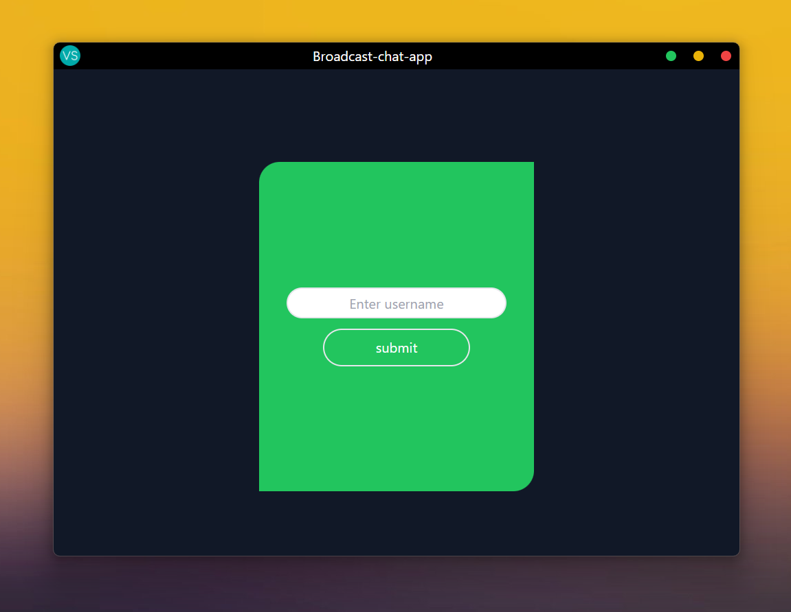
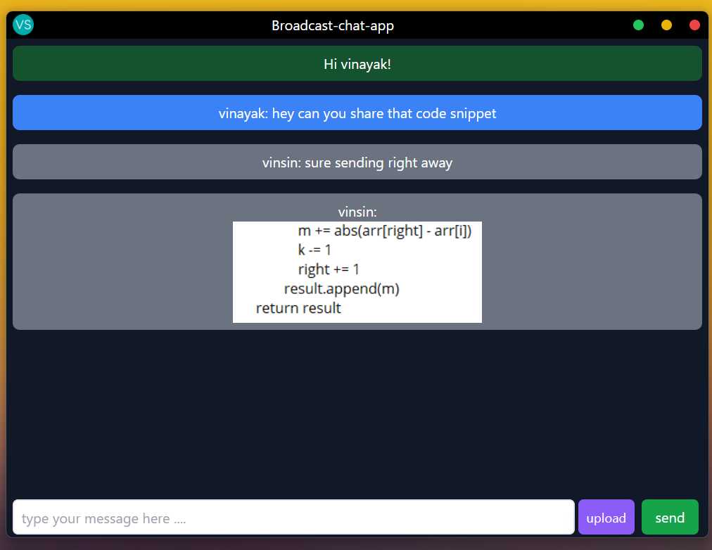
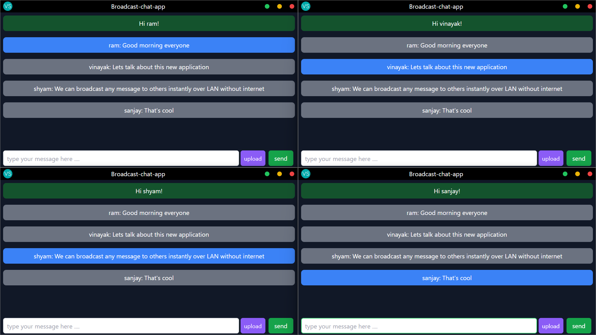

# Broadcast-chat-app

A cross-platform desktop app built with Electron.js, Tailwind CSS and React.js. The app allows users to broadcast messages and share images with other devices on the same network in real-time using Socket.io.

• Designed and developed a cross-platform desktop application using Electron.js, React, and Tailwind CSS.
• Implemented real-time communication functionality through Socket.IO web sockets, allowing users to broadcast 
messages to other users on the network.
• Built a robust backend Node.js server with Express.js, CORS, and Socket.IO to handle incoming messages and 
broadcast them to all other users on the network.

Below you can find working screenshots of the project

## Getting Started

To start the Client application on a development server :

1. ```cd Client```
2.  Install the node dependencies ```npm install```
1. Install the required node modules by running `npm start`.
2. Start the React server by running `npm react:dev`.
3. Start the Electron development server by running `npm electron:dev`.
4. Once everything seems perfect we can build the production version using ``` npm run build ``` the installation file will be reflected in ```/Client/dist``` by default this would be an application native to the operating system it was built from

To Start the background chat server :

1. ```cd Server```
2. Install the node dependencies ```npm install```
3. Run the server with ```npm start```

## Screenshots



